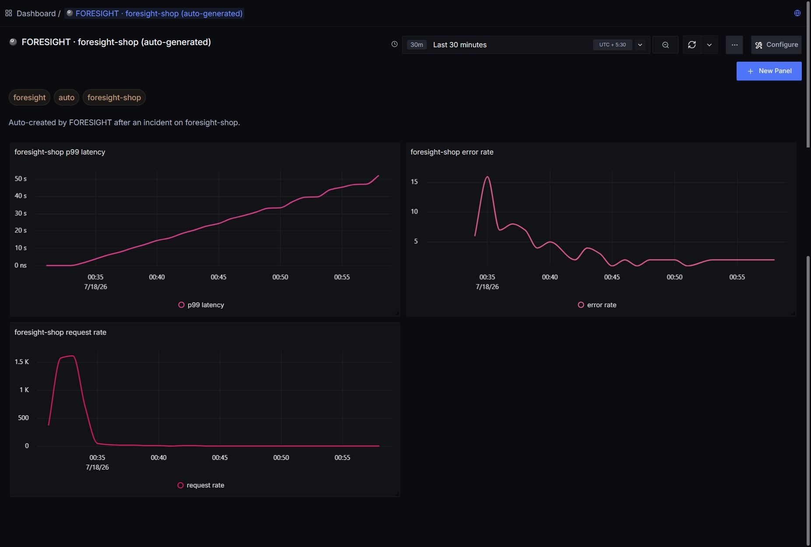
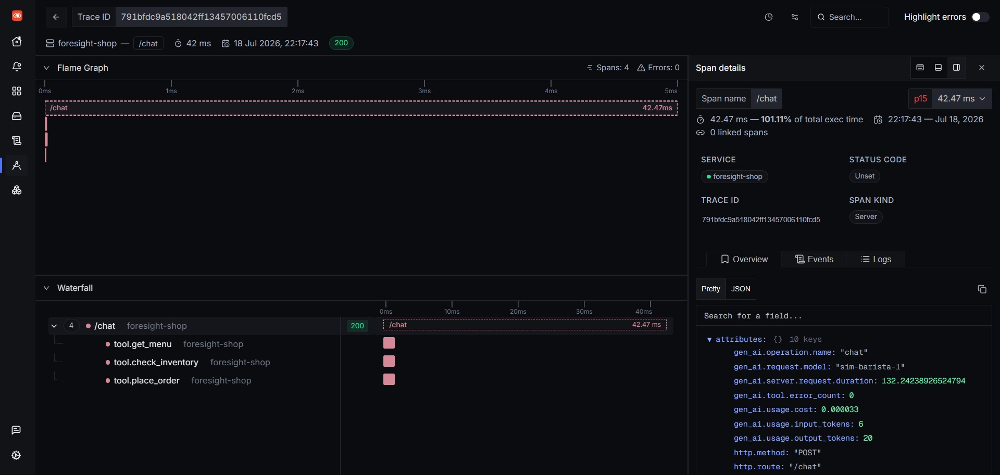
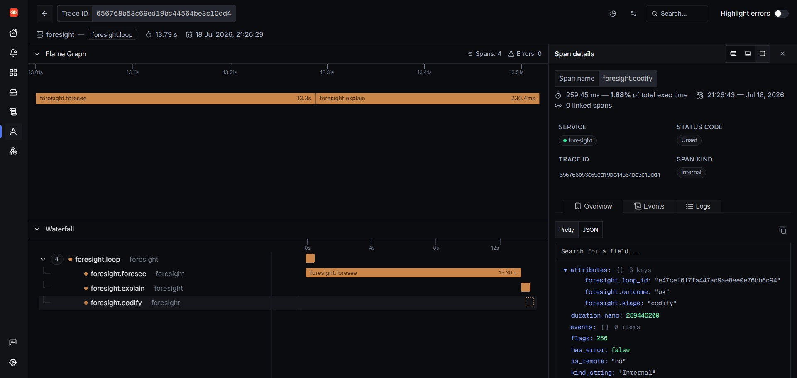
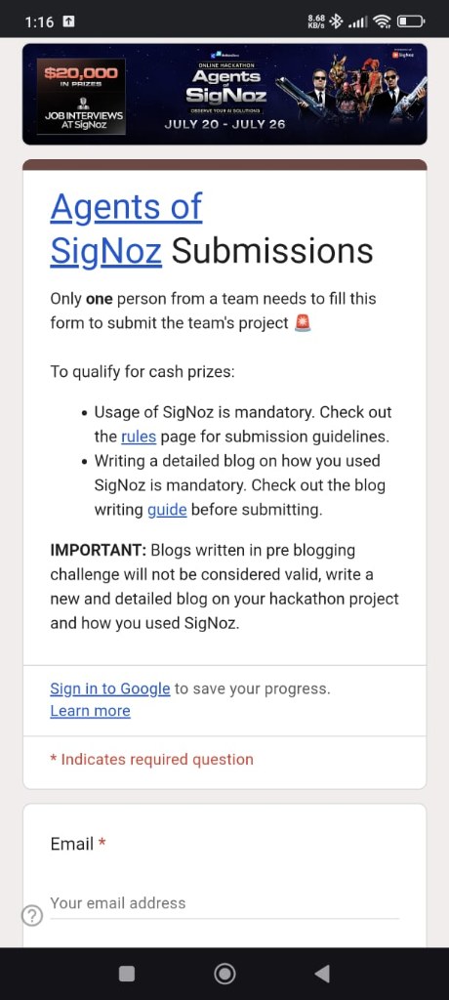
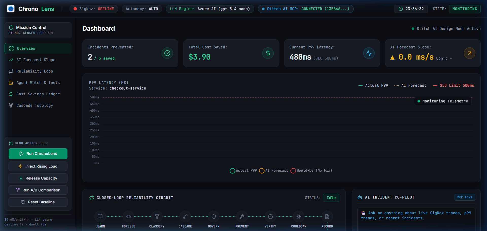
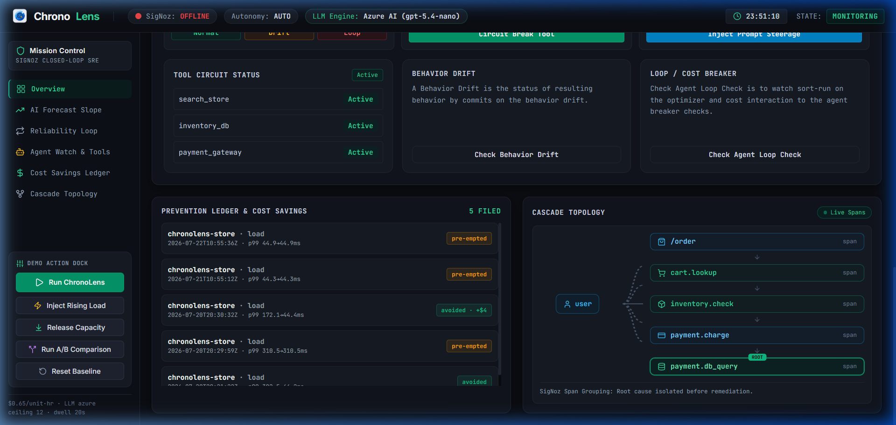

# ChronoLens: Building a Predictive SRE Control Plane with SigNoz, WhatsApp Approve-to-Act, Slack, and Agent Watch

> **Submitted for the Agents of SigNoz Hackathon 2026 (Track 1: AI & Agent Observability)**

---

## Executive Summary

Traditional Site Reliability Engineering (SRE) is inherently **reactive**. Alerts trigger *after* P99 latency breaches an SLO wall, *after* error rates spike, or *after* customers experience downtime. In microservice architectures and AI agent workflows, this lag costs thousands of dollars per minute in degraded user experience and uncontained infrastructure cascades.

**ChronoLens** transforms SRE from reactive post-mortems into **predictive, closed-loop prevention**. Powered by **SigNoz** as its observability backbone, ChronoLens:

1. **Predicts SLO Breaches Before They Happen**: Uses real-time linear regression on SigNoz P99 latency telemetry to calculate breach slope (`ms/s`) and exact ETA to breach.
2. **Human-in-the-Loop Approve-to-Act via WhatsApp & Slack**: Fires interactive WhatsApp cards with `[✅ Approve Fix]` and `[❌ Deny Fix]` buttons and simultaneous Slack notifications (`#sre-alerts`) directly to on-call engineers.
3. **Closed-Loop Remediation & SigNoz Verification**: Executes automated, reversible actions (`scale_out`, `rollback`, `cache_warm`) and immediately re-queries SigNoz to verify that P99 returned below SLO before closing the incident loop.
4. **Agent Watch (GenAI Spans Observability)**: Monitors OpenTelemetry GenAI spans in SigNoz to detect LLM token cost drift, latency degradation, and context window bloat, triggering an automatic circuit breaker.
5. **Multilingual Bharat Voice Layer**: Integrates Sarvam AI (Saarika STT & Bulbul TTS) to deliver voice and Hindi/English alerts.

---

## 🏛️ Comprehensive Architecture & Detailed Working

ChronoLens connects SigNoz observability with multi-channel human feedback (WhatsApp & Slack) and automated closed-loop remediation:

```
                  ┌───────────────────────────────────────────┐
                  │           SigNoz Observability            │
                  │   (P99 Metrics API + OTel GenAI Spans)    │
                  └─────────────────────┬─────────────────────┘
                                        │
                                        ▼ Real-Time Telemetry Poll
                  ┌───────────────────────────────────────────┐
                  │    ChronoLens Forecasting Engine          │
                  │   (Linear Regression & Slope Analysis)    │
                  └─────────────────────┬─────────────────────┘
                                        │
                       Breach Forecast Detected (P99 -> SLO)
                                        │
                    ┌───────────────────┴───────────────────┐
                    ▼                                       ▼
        ┌───────────────────────┐               ┌───────────────────────┐
        │  WhatsApp Business    │               │     Slack Webhook     │
        │ Cloud API Interactive │               │    (#sre-alerts)      │
        └───────────┬───────────┘               └───────────────────────┘
                    │
          Engineer Taps [Approve]
                    │
                    ▼ Webhook Callback (HMAC SHA-256)
        ┌───────────────────────────────────────────────────┐
        │          Closed-Loop SRE Engine                   │
        │   PREVENT ──► VERIFY ──► COOLDOWN ──► RECORD      │
        └───────────────────┬───────────────────────────────┘
                            │
                            ▼ Telemetry Verification
        ┌───────────────────────────────────────────────────┐
        │         SigNoz Telemetry Re-Query                 │
        │    (Confirms P99 < 500ms SLO Wall)                │
        └───────────────────────────────────────────────────┘
```

---

### Step-by-Step Lifecycle Flow

```
┌──────────────────────────────────────────────────────────────────────────────────┐
│                               CHRONOLENS LIFECYCLE                               │
├──────────────┬───────────────────────────────────────────────────────────────────┤
│ PHASE 1      │ Real-time Telemetry Ingestion from SigNoz Query Builder           │
│              │ • Polls p99(duration_nano) per service every 2 seconds           │
│              │ • Computes d(P99)/dt slope over 60-second sliding window           │
├──────────────┼───────────────────────────────────────────────────────────────────┤
│ PHASE 2      │ Predictive SLO Breach Forecasting                                 │
│              │ • Evaluates ETA to breach: (SLO_Wall - Current_P99) / Slope       │
│              │ • Triggers alert when ETA < 30s AND P99 approaching SLO wall      │
├──────────────┼───────────────────────────────────────────────────────────────────┤
│ PHASE 3      │ Multi-Channel Human-in-the-Loop Dispatch                          │
│              │ • Meta WhatsApp Cloud API: Interactive Approve/Deny buttons       │
│              │ • Slack Webhook: Real-time alert card to #sre-alerts channel       │
│              │ • Sarvam AI: Hindi/English voice call & STT/TTS alert dispatch     │
├──────────────┼───────────────────────────────────────────────────────────────────┤
│ PHASE 4      │ Webhook Processing & HMAC SHA-256 Verification                   │
│              │ • Validates Meta x-hub-signature-256 header against app secret   │
│              │ • Extracts button ID (wa_appr:service:action) and executes        │
├──────────────┼───────────────────────────────────────────────────────────────────┤
│ PHASE 5      │ Closed-Loop Remediation & SigNoz Metric Verification               │
│              │ • Executes reversible fix (e.g., scale_out +1 unit)              │
│              │ • Re-queries SigNoz to verify P99 dropped under 500ms SLO wall    │
│              │ • Records incident avoided & dollar savings in Prevention Ledger  │
├──────────────┼───────────────────────────────────────────────────────────────────┤
│ PHASE 6      │ Agent Watch GenAI Circuit Breaker                                 │
│              │ • Ingests OTel gen_ai.* span attributes from SigNoz               │
│              │ • Detects 3x token cost drift -> triggers Break & Pin baseline     │
└──────────────┴───────────────────────────────────────────────────────────────────┘
```

---

## 🔬 How ChronoLens Uses SigNoz & OpenTelemetry

SigNoz is not an afterthought in ChronoLens — it is the **central nervous system**:

### 1. P99 Latency Telemetry & Predictive Forecasting
ChronoLens polls SigNoz telemetry at high frequency using the SigNoz Query Builder API (`queryType: "builder"`, aggregation `p99(duration_nano)`). Instead of waiting for `P99 > 500ms`, our forecasting engine calculates the rate of latency growth ($\frac{d(P99)}{dt}$) over a sliding window:

$$\text{ETA to Breach} = \frac{\text{SLO Wall} - \text{Current P99}}{\text{Slope (ms/s)}}$$

If $P99 = 480\text{ms}$, $\text{SLO} = 500\text{ms}$, and $\text{Slope} = +18.5\text{ms/s}$, ChronoLens forecasts an SLO breach in **18.2 seconds** and triggers proactive remediation before any user experiences a failure.


*Figure 1: SigNoz dashboard with real-time P99 latency, error rates, and 500ms SLO threshold metrics.*

---

### 2. GenAI Spans & Agent Watch (Track 1 Focus)
AI agents behave unpredictably: prompt bloat, infinite retry loops, and token cost surges can silently degrade application economics. 

ChronoLens ingests **SigNoz OpenTelemetry GenAI Semantic Conventions**:
- `gen_ai.request.model` — Model identifier (e.g. `gpt-5.4-mini`, `gpt-5.4-nano`)
- `gen_ai.usage.prompt_tokens` — Input prompt token count
- `gen_ai.usage.completion_tokens` — Output completion token count
- `gen_ai.client.token.cost` — Derived cost per request
- `gen_ai.operation.name` — Operation name (`chat`, `completion`, `embeddings`)
- `gen_ai.tool.name` — Executed agent tool name with status

When token cost drifts **> 3x above baseline** in a 60-second window, the **Agent Watch Circuit Breaker** fires an interactive WhatsApp card and Slack message permitting the SRE to:
- **Throttle Agent Context Window**: Truncates history to prevent token explosions.
- **Pin Baseline Model**: Reverts from expensive models (e.g. GPT-5.4) back to cost-optimized fallback models (e.g. gpt-5.4-nano).


*Figure 2: SigNoz Traces Explorer displaying an LLM request span with OpenTelemetry `gen_ai.*` attributes expanded (`gen_ai.request.model`, token usage, cost per request).*

---

### 3. Self-Observability (Watching the Watcher)
ChronoLens emits its own OpenTelemetry spans into SigNoz — one span per predictive cycle step, tagged with `chronolens.stage` / `foresight.stage` attributes. The prediction → WhatsApp approval → execution loop is fully traceable within SigNoz right alongside monitored microservices.


*Figure 3: ChronoLens self-trace in SigNoz showing the entire execution pipeline.*

---

### 4. Verification Loop
Remediation without verification is dangerous. After executing an action (`scale_out`), ChronoLens queries SigNoz to verify that:
1. P99 latency dropped below the 500ms SLO target.
2. Error rates did not spike.
3. System metrics stabilized.

Only after SigNoz confirms stabilization does ChronoLens mark the incident as **PREVENTED** in the **Prevention Ledger**.

---

## 🚀 Two-Way Notification Channels & Integration Layer (WhatsApp, Slack, Sarvam AI)

Alert fatigue is real. SREs receive hundreds of unactionable notifications daily across fragmented channels. ChronoLens unifies on-call notifications into **interactive, multi-channel approve-to-act workflows**:



### Multi-Channel Feature Matrix

| Feature | 📱 WhatsApp (Meta Cloud API) | 💬 Slack (#sre-alerts) | 🎙️ Sarvam AI (Bharat Voice) |
|---------|------------------------------|------------------------|-----------------------------|
| **Protocol / Transport** | Meta Graph API v23.0 + Webhook | Incoming Webhook (Block-Kit) | Saarika STT & Bulbul TTS REST |
| **Interactivity** | `[✅ Approve Fix]` / `[❌ Deny Fix]` Reply Buttons | Real-time Channel Status Cards | Interactive Voice Response (IVR) |
| **Security** | HMAC-SHA256 (`x-hub-signature-256`) | Secret Webhook Tokens | Bearer API Key Authentication |
| **Automation** | Conversational Automation (Icebreakers & Slash Commands) | Webhook Channel Dispatch | Multilingual Translation (`hi-IN`) |
| **Use Case** | On-call Mobile Approve-to-Act | Team Incident Channel Visibility | Critical Voice Escalation Calls |

---

### Channel Deep-Dive

1. **Meta WhatsApp Cloud API (Interactive Approve-to-Act)**:
   - Delivers interactive cards with `[✅ Approve Fix]` and `[❌ Deny Fix]` buttons directly to on-call mobile devices.
   - Built-in conversational automation providing tappable starter prompts (*"Check live SRE health"*, *"Trigger incident approval card"*) and slash commands (`/status`, `/approve`, `/agents`, `/test`, `/ledger`, `/loop`, `/help`).
   - Inbound button taps are validated via HMAC-SHA256 signature checking on `/webhook/whatsapp` and trigger instant closed-loop execution.

2. **Slack Integration (`#sre-alerts`)**:
   - Posts rich Slack Block-Kit formatted alert cards to the `#sre-alerts` channel (`SLACK_WEBHOOK_URL`, channel `C0BKQTT7TL1`).
   - Displays affected microservice, current P99 latency, slope trajectory, estimated time to breach, and remediation status for full team transparency.

3. **Sarvam AI (Multilingual Voice & Translation Layer)**:
   - Provides Indian regional language support (`hi-IN` Hindi / `en-IN` English).
   - Uses **Saarika v2.5 STT** for speech recognition and **Bulbul v3 TTS** (`ritu` speaker voice) for automated voice escalation calls when latency breaches imminent SLO targets.

---

## 🌐 Mission Control Dashboard



The ChronoLens web dashboard (`http://localhost:8095`) provides complete real-time visibility:
- **Top 4 Scorecards**: Incidents Prevented, Total Cost Saved, Current P99 Latency vs. SLO, and Agent Watch Circuit Status.
- **Dark Emerald P99 Latency Graph**: Live Chart.js visualization comparing actual latency against the predicted slope and 500ms SLO threshold.
- **Vertical Cascade Topology**: Service dependency graph (`/order` → `cart.lookup` → `inventory.check` → `payment.charge` → `payment.db_query`) highlighting root-cause spans.



- **Prevention Ledger**: Real-time log of every prevented incident, action taken, and dollar savings.

---

## 🤖 AI Models, IDEs & Developer Tooling Used

Building a production-grade predictive SRE engine in a hackathon timeframe required leverage across cutting-edge AI models, specialized IDEs, and developer tools:

| Category | Tool / Model | Role & Contribution |
|----------|--------------|----------------------|
| **Primary Code Generation & Logic** | **Codex (GPT-5.6 Terra)** | Generated core SRE forecasting algorithms, FastAPI webhook signature logic, and linear regression models. |
| **IDE & Architectural Guidance** | **Kiro IDE (Claude Opus 4.8)** | Handled system design, property-based testing setup (Hypothesis), and complex async control loop structuring. |
| **Agentic IDE & Execution Engine** | **Google Antigravity IDE (Gemini 3.6 Flash)** | Pair programmer agent orchestrating terminal execution, browser testing subagent, git subtree management, and multi-file refactoring. |
| **Multilingual Voice/Speech** | **Sarvam AI (Saarika / Bulbul)** | Handled Hindi/English speech-to-text, text-to-speech, and translation. |
| **LLM Runtime Engine** | **Azure AI Foundry (gpt-5.4-mini / gpt-5.4-nano)** | Powered the fast high-frequency message classifier and agent watch reasoning engine. |
| **Observability Infrastructure** | **SigNoz & SigNoz MCP Server** | Telemetry ingestion, metrics API, OpenTelemetry GenAI spans, ClickHouse query engine, and MCP tool automation. |

---

## 🛠️ Complete Tech Stack

- **Observability**: SigNoz (P99 Telemetry, OTel GenAI Spans, ClickHouse Query API, MCP Server)
- **Backend & Webhook**: Python 3.11, FastAPI, Uvicorn, HMAC-SHA256
- **Predictive Engine**: NumPy, SciPy (Linear Regression Slope Analysis)
- **Messaging & Channels**: 
  - WhatsApp Business Cloud API (Meta Graph API v23.0)
  - Slack Webhook Integration (`#sre-alerts`)
- **Multilingual / Voice**: Sarvam AI (Saarika STT, Bulbul TTS, Translate API)
- **LLM Engine**: Azure AI Foundry (`gpt-5.4-mini` / `gpt-5.4-nano`)
- **Frontend**: Vanilla JS, Tailwind CSS, Chart.js, Lucide Icons
- **Deployment**: Docker, Docker Compose, Reticule VPS

---

## 💡 What We Learned & Key Takeaways

1. **Predictive > Reactive**: Catching latency trends 15-20 seconds before breach prevents user impact entirely.
2. **SigNoz Telemetry is Surprisingly Rich**: SigNoz's OpenTelemetry integration allowed us to query both standard microservice metrics and GenAI LLM span telemetry out-of-the-box.
3. **Human-in-the-Loop Builds Trust**: Full autonomous remediation can be terrifying for SRE teams. WhatsApp interactive Approve-to-Act and Slack channel alerts balance speed with human governance.
4. **AI-Assisted Pair Programming**: Combining Codex (GPT-5.6 Terra), Kiro IDE (Claude Opus 4.8), and Google Antigravity IDE (Gemini 3.6 Flash) enabled shipping a multi-tier SRE system in record time.

---

## 🔗 Links & Resources

- **GitHub Repository**: [https://github.com/greninja-op/ChronoLens](https://github.com/greninja-op/ChronoLens)
- **Live Demo Dashboard**: `http://localhost:8095`
- **SigNoz Project**: [https://signoz.io](https://signoz.io)
