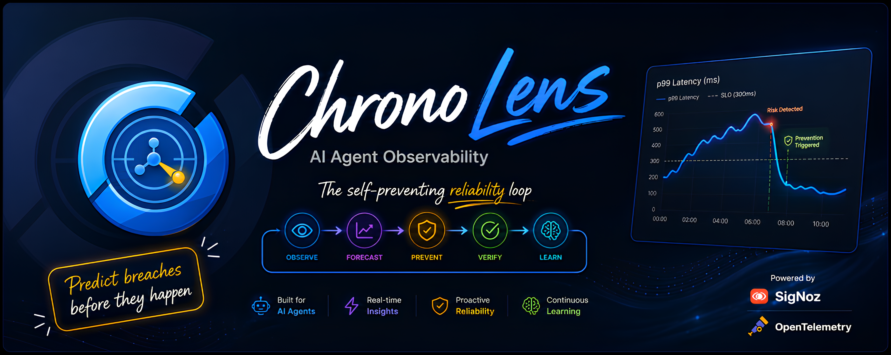

<p align="center">
  
</p>

# ChronoLens — the self-preventing reliability loop

> Predicts a breach from live SigNoz telemetry, takes a **reversible** action to stop it before it lands, verifies via SigNoz that it worked, and files a receipt — the outage that never happened.

Built for the **Agents of SigNoz** hackathon (Track: AI & Agent Observability).

> **Status:** verified end-to-end against a live SigNoz. A managed run predicts a breach and VERIFY confirms via SigNoz that p99 dropped back under the SLO — "breach avoided" — then files a receipt. **Mission Control** is at `http://localhost:8095`.
> Tailwind / Chart.js / Lucide are **vendored offline** in `static/vendor/`, so the UI works with no internet; only the web fonts are fetched from the network (it degrades to system fonts without them).

## Headline features

| Feature | What it does | Where |
| --- | --- | --- |
| **Chrono-Proof** | Proves the outage that never happened, from **measured** SigNoz data: fits the trend on pre-action samples only, extrapolates the unmitigated path (± band), overlays the measured reality, and reports breach-seconds avoided / peak shaved / error budget saved. Every field is labelled `measured` vs `projected`. | `src/chronolens/proof.py` · `GET /api/proof` · `cli proof` |
| **Blast-radius forecast** | Predicts **which services fall next, in what order, and when** — from SigNoz's own service dependency graph plus each service's p99 trend. Names the most-downstream degrading service as the cause so remediation targets the root, not the loudest alarm. | `src/chronolens/blastradius.py` · `GET /api/blast` · `cli blast` |
| **The closed loop** | LEARN → FORESEE → CLASSIFY → CASCADE → GOVERN → PREVENT → VERIFY → COOLDOWN → RECORD, with a confidence guard, anti-flap guardrails and a trust ladder. | `src/chronolens/loop.py` · `cli respond` |
| **Agent Watch** | Behaviour drift, a loop / cost-spiral breaker, and answer-quality grading for an OpenTelemetry-instrumented demo LLM agent. Drift and the loop breaker read the agent's **GenAI spans out of SigNoz** (`source=signoz`). | `drift.py` `loopguard.py` `judge.py` · `/api/agent/*` |
| **Approve-to-act** | When GOVERN only *suggests*, ChronoLens posts an interactive **Approve / Deny** card to Slack (Socket Mode) or WhatsApp; approving runs the real PREVENT → VERIFY → COOLDOWN → RECORD path and edits the message with the SigNoz-verified outcome. | `slack_bot.py` `whatsapp_bot.py` · `cli slack` |

## The closed loop (loop engineering)
```
LEARN    → read past incidents (incl. time-of-day seasonality); for a repeat
           offender, pre-provision a higher floor BEFORE any breach + act earlier
FORESEE  → watch a service's p99, project the trend to a time-to-breach,
           behind a CONFIDENCE GUARD so it won't act on noise
CLASSIFY → the PLAYBOOK maps the dominant signal to the matching reversible fix
           (load→scale · dependency→circuit-break · pool→resize · memory→restart · errors→rollback)
CASCADE  → name the root hop the failure will spread from (fix cause, not symptom)
GOVERN   → the TRUST LADDER decides whether it may act solo yet (suggest/earn/auto)
PREVENT  → take the reversible action behind ANTI-FLAP GUARDRAILS (dwell + ceiling)
VERIFY   → confirm via SigNoz the breach was actually avoided (else roll back)
COOLDOWN → once the load subsides, scale back to baseline and SAVE COST (in $)
RECORD   → file the receipt (signal, cost saved, NL explanation, guard artifacts)
           + NOTIFY a Slack/webhook, + emit ChronoLens's own metrics to SigNoz
   ▲                                                                    │
   └──────────────── the ledger feeds LEARN next time ──────────────────┘
```
It's a genuine closed loop: every incident's receipt becomes the memory that makes the next one less likely — and when the spike passes, ChronoLens gives the capacity back so you're not paying for idle headroom. ChronoLens is itself OpenTelemetry-instrumented (traces **and** metrics), so its own loop shows up in SigNoz (full-circle).

### What ChronoLens decides (not just autoscaling)
- **Playbook** — different failure signals get different reversible fixes, not always "scale". A slow dependency gets circuit-broken; a bad deploy gets rolled back; a leaking pool gets resized.
- **Confidence guard** — needs enough samples, a slope above a noise floor, and a *sustained* rise before it calls a breach. No acting on jitter.
- **Anti-flap guardrails** — a minimum dwell time between actions and a hard capacity ceiling, so the loop can't oscillate or scale to infinity.
- **Trust ladder** — `suggest` (human-in-the-loop) · `earn` (autonomous only after N verified saves on that service) · `auto` (demo default).
- **Cost in dollars** — capacity units returned on cooldown are valued in `$` via `COST_PER_UNIT_HR`.
- **Notifications** — posts a prevented/escalated note to a Slack incoming webhook (or any `{"text":...}` webhook).
- **Pluggable LLM** — plain-English explanations from a rule-based default, optionally enriched by OpenAI / Bedrock / Gemini. Runs with no key.

## Architecture (local dev)
```
demo store ──OTel──▶ SigNoz + MCP (Foundry)
                          ▲   │
                          │   ▼
                     ChronoLens (this app)
                foresee · prevent · verify · record
                          │
                          ▼
                   Mission Control UI  (http://localhost:8095)
```
Production target is serverless AWS (Bedrock + Lambda + EventBridge + DynamoDB + S3).

## One-command app tier
After SigNoz is up (`bash scripts/bringup.sh`) and `SIGNOZ_API_KEY` is set:
```bash
docker compose up --build          # demo store + Mission Control together
# or, without Docker:
bash scripts/run-all.sh            # (Windows: scripts\run-all.ps1)
```
Then open http://localhost:8095.

## Prerequisites
- **Python 3.9+**
- **Docker** (with Compose v2). On **Windows use WSL2 (Ubuntu)** — Foundry runs on Linux/macOS.
- **Foundry** (`foundryctl`) to bring up SigNoz + its MCP server in one command.

---

## Quickstart

### 1. Bring up SigNoz + MCP (one command, in WSL2/bash)
```bash
bash scripts/bringup.sh
# or drive Foundry directly:  foundryctl cast -f casting.yaml
```
This stands up SigNoz UI (:8080), the OTel collector (:4317/:4318), and the SigNoz MCP server (:8000/mcp).

### 2. Configure ChronoLens
Create an **Admin/Editor API key** in SigNoz (Settings → API Keys), then:
```bash
cp .env.example .env          # fill in SIGNOZ_URL + SIGNOZ_API_KEY
pip install -r requirements.txt
```

### 3. Run it — three terminals

**Windows PowerShell:**
```powershell
# terminal 1 — the demo store (streams OTel traces to SigNoz, admin knobs on :8090)
$env:PYTHONPATH="src"; python -m demo_store.store

# terminal 2 — Mission Control UI on http://localhost:8095
$env:PYTHONPATH="src"; python app.py

# terminal 3 — drive the loop from the CLI (optional; the UI has buttons too)
$env:PYTHONPATH="src"; python -m chronolens.cli services
```

**macOS/Linux/WSL2 (bash):**
```bash
export PYTHONPATH=src
python -m demo_store.store          # terminal 1
python app.py                       # terminal 2
python -m chronolens.cli services   # terminal 3
```

> **Windows note:** always set `PYTHONPATH=src` (the package lives under `src/`).

---

## The demo (the money shot: an A/B)

Open **http://localhost:8095**, then:

1. Click **Inject rising load** — the demo store's demand climbs; watch the p99 chart start rising toward the SLO.
2. Click **Run baseline (no fix)** first — ChronoLens forecasts the breach but takes no action → it breaches (the "without me" arm).
3. **Reset to healthy**, inject again, then click **Run ChronoLens** — it predicts, scales out *before* the breach, verifies via SigNoz, and the line never reaches the wall.
4. The **Incidents Prevented** scoreboard ticks up with the receipt.

Same fault, run twice: one breaches, one gets defused. That's the demo.

### From the CLI
```bash
python -m chronolens.cli foresee       # forecast the worst service now
python -m chronolens.cli respond       # full closed loop: learn→foresee→classify→govern→prevent→verify→cooldown→record
python -m chronolens.cli respond off   # baseline arm: predict + record, no action (A/B)
python -m chronolens.cli ab            # run baseline then managed back-to-back (the A/B)
python -m chronolens.cli cooldown      # give spare capacity back once load subsides (save cost)
python -m chronolens.cli prevented     # the receipts ledger (units + $ saved, per-signal)
python -m chronolens.cli config        # show autonomy / guardrails / cost / LLM / Slack config
python -m chronolens.cli proof         # CHRONO-PROOF: the SigNoz-measured counterfactual
python -m chronolens.cli blast         # BLAST-RADIUS: who falls next, in what order, and when
python -m chronolens.cli slack test    # post a Slack approval card
python -m chronolens.cli slack         # run the Socket Mode listener (approve-to-act)
```

### Generating demo traffic
The loop needs a live p99 series to forecast against:
```bash
python scripts/loadgen.py 600 10                       # 600s at ~10 rps
curl "localhost:8090/admin/fault?mode=traffic-ramp&level=12"   # ramp latency toward the SLO
curl "localhost:8090/admin/fault?mode=dependency-slow&level=25" # slow the deepest tier (blast radius)
curl "localhost:8090/admin/fault?mode=off&level=0"     # clear
```
> Fault modes: `traffic-ramp`, `traffic-wave`, `dependency-slow`, `pool-leak`, `error-spike`, `memory-leak`.

### Tests
```bash
pip install -r requirements-dev.txt
pytest        # property-based (Hypothesis) + unit tests for every stage
```

---

## SigNoz features used
ChronoLens leans on SigNoz across **reads, writes, and both signals**:

- **Query Builder v5 (traces)** — every p99/RED read is a `queryType:"builder"` traces query (`p99(duration_nano)`), the same shape the SigNoz MCP server executes.
- **Query Builder v5 (logs)** — CLASSIFY corroborates the `errors` signal with a `count()` logs query (`severity_text='ERROR'`), so classification is cross-checked across two signals.
- **Grouped traces query → data-driven CASCADE** — p99 grouped by span name finds the *measured* slowest hop, so the blast-path root comes from real traces, not a hardcoded topology.
- **Service dependency graph** (`/api/v1/dependency_graph`) — the real parent→child call graph SigNoz derives from traces. This is the substrate for the **blast-radius forecast**; the demo store emits spans under three service names (`chronolens-store` → `chronolens-payments` → `chronolens-payments-db`) so the graph has a genuine chain to walk.
- **Raw traces query (GenAI spans)** — a `requestType: "raw"` traces query pulls the demo agent's `agent.turn` spans with their OpenTelemetry GenAI attributes (`gen_ai.request.model`, `gen_ai.usage.*`, `llm.step_count`, `llm.cost_usd`, `agent.tools`), so **Agent Watch detects drift and cost spirals from telemetry in SigNoz** rather than by calling the agent.
- **p99 time series** — `requestType: "time_series"` powers the forecast chart and Chrono-Proof's measured arm.
- **Services / RED stats** — to pick and score services.
- **Alerts** — a guarding threshold alert on the service p99 (`create_alert`).
- **Dashboards** — a guard dashboard with a p99 latency panel **and** a panel that reads back ChronoLens's own `chronolens.prevented_total` metric (full-circle).
- **Saved views** — a Traces-explorer view pinned to the guarded service.
- **Silences** — while the loop actively remediates, it silences that service's alert so nobody's paged for a fix already in flight, then lifts the silence after VERIFY.
- **Alert history / state** — LEARN reads whether guard alerts are firing to confirm recurrence from SigNoz, not just from the local ledger.
- **Trace detail (exemplar)** — pulls a recent trace id for the service as evidence / a deep-link.
- **MCP server — actually called, not just "compatible"** — `src/chronolens/mcp.py` is a real JSON-RPC
  MCP client (`initialize` → `tools/list` → `tools/call`) against the SigNoz MCP server Foundry installs.
  Live: `SigNozMCP`, protocol `2024-11-05`, **41 tools**. The **co-pilot** (`/api/mcp/chat`,
  `python -m chronolens.cli mcp "<question>"`) routes a plain-English question to real MCP tools —
  `signoz_list_services`, `signoz_list_alert_rules`, `signoz_search_logs`,
  `signoz_get_service_top_operations` — and shows every tool call it made. `/api/mcp/status` reports the
  live tool count. Verify it yourself: `python scripts/verify_mcp.py`.
- **Full-circle self-telemetry** — ChronoLens exports its own OTel **spans** (`chronolens.stage`) **and metrics** (`chronolens.prevented_total`, `cost_saved_usd`, `seconds_to_breach`), so its loop is visible in SigNoz next to the app it protects.

## Layout
```
chronolens/
├── demo_store/store.py        # the watched app: 5 fault types + reversible levers
├── src/chronolens/
│   ├── config.py  signoz.py  otel_self.py  metrics_self.py
│   ├── learn.py   foresee.py  cascade.py  playbook.py  prevent.py  guardrails.py
│   ├── proof.py         # CHRONO-PROOF — the SigNoz-measured counterfactual
│   ├── blastradius.py   # BLAST-RADIUS — who falls next, in what order, and when
│   ├── drift.py  loopguard.py  judge.py       # Agent Watch analyzers
│   ├── slack_bot.py  whatsapp_bot.py  copilot.py   # approve-to-act + NL co-pilot
│   ├── governance.py  verify.py  cooldown.py  dollars.py  notify.py  llm.py  record.py
│   ├── loop.py    # learn→foresee→classify→govern→prevent→verify→cooldown→record
│   └── cli.py
├── app.py + static/index.html # Mission Control UI (+ side-by-side A/B view)
├── infra/                     # AWS serverless scaffold (SAM: Lambda+EventBridge+DynamoDB+Bedrock)
├── tests/                     # property-based (Hypothesis) + unit tests
├── scripts/bringup.sh         # one-command SigNoz + MCP (Foundry)
├── casting.yaml               # committed Foundry install
├── requirements.txt  requirements-dev.txt  pytest.ini  .env.example
```

## Ports
| Service | URL |
| --- | --- |
| SigNoz UI | http://localhost:8080 |
| SigNoz MCP | http://localhost:8000/mcp (`/livez`) |
| OTLP ingest | localhost:4317 (gRPC) / 4318 (HTTP) |
| Demo store admin | http://localhost:8090/admin/status |
| Mission Control | http://localhost:8095 |
